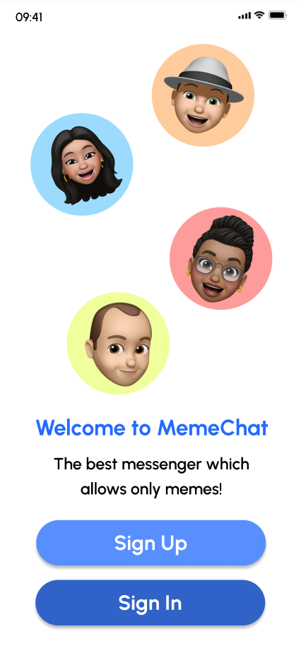
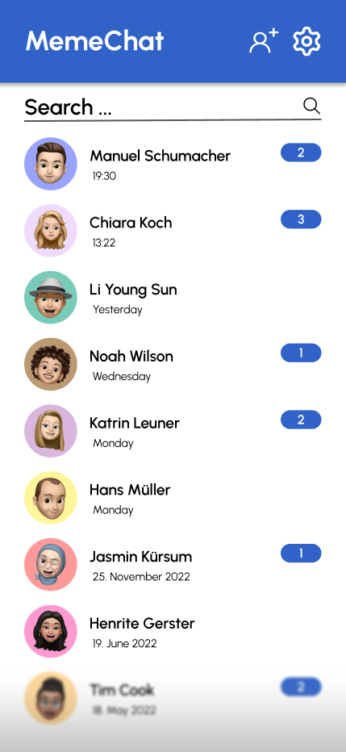

# M335

> Manuel Schumacher   > 21r8390@bztf.ch

## Planung

Für die Planung des Projektes wurden diverse Tools wie [PlantUML](https://plantuml.com) & [Figma](https://www.figma.com) verwendet. Die Icons stammen von [Octicons](https://primer.style/octicons/).

### Wireframes

Die Wireframes wurden mit Figma erstellt und sind unter [dieser URL](https://www.figma.com/file/g6iFaxCSq3TIzCLwxlFqvR/M335-Chatapp-Wireframes?node-id=1%3A2) auffindbar. Hier sind zwei Screenshots der Wireframes zu sehen:

    
    

